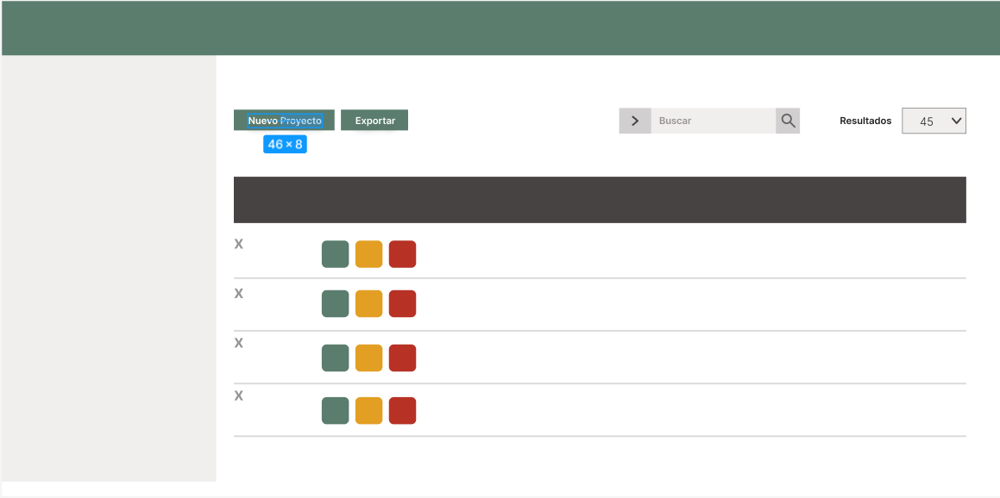

# MercaSys: Sistema de Gestión de Inventario

## **Propuesta**

Se propone desarrollar **MercaSys**, un programa que brinda un servicio integral de gestión de inventario diseñado específicamente para una tienda de abarrotes. Este sistema tendrá como objetivo optimizar la administración de productos, reducir los errores humanos y mejorar la eficiencia operativa del negocio.

## **Funciones Principales**

El sistema implementará funcionalidades CRUD (Crear, Leer, Actualizar y Eliminar), lo que permitirá:

- **Registrar productos:** Añadir nuevos productos al inventario con detalles clave como nombre, categoría, precio y cantidad.
- **Actualizar inventario:** Modificar datos de los productos existentes, como precios o descripciones.
- **Consultar inventario:** Generar un listado detallado del stock, mostrando información esencial como cantidades disponibles y categorías.
- **Eliminar productos:** Remover productos que ya no estén disponibles o que hayan sido descontinuados.
- **Gestión de stock:** Incrementar o disminuir la cantidad de productos según las entradas o ventas realizadas.

## **Características Adicionales**

- **Reportes de inventario:** Generar reportes personalizados para identificar los productos más vendidos, faltantes o próximos a agotarse.
- **Alertas de stock bajo:** Notificar al administrador cuando el inventario de un producto alcance un nivel mínimo predefinido.
- **Búsqueda avanzada:** Buscar productos por nombre, categoría o rango de precios.
- **Interfaz amigable:** Diseñar una interfaz simple e intuitiva para facilitar el uso del sistema a usuarios con conocimientos básicos de tecnología.

## **Resultados Esperados**

El objetivo final de **MercaSys** es ofrecer una solución funcional y eficiente que simplifique la administración del inventario en tiendas de abarrotes. Los beneficios incluyen:

- **Optimización del tiempo:** Automatización de tareas repetitivas para reducir el tiempo dedicado a la gestión manual.
- **Mejora en la eficiencia operativa:** Reducción de errores humanos y mejor control del stock.
- **Facilitación en la toma de decisiones:** Acceso a datos precisos y actualizados para apoyar la planificación y el reabastecimiento.

**MercaSys** está diseñado para ser una herramienta fundamental en la gestión diaria de una tienda de abarrotes, contribuyendo al crecimiento y la sostenibilidad del negocio.

## **Boceto de la Interfaz Gráfica**

